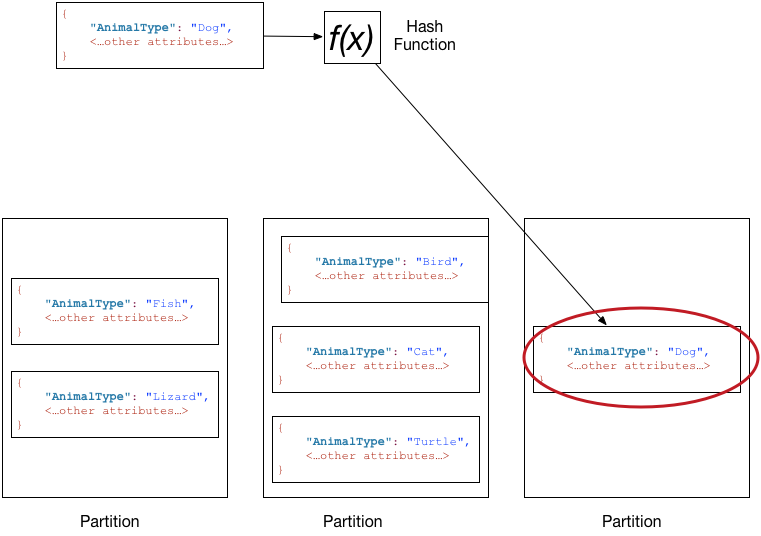

# DynamoDB Fast Scan & Update

As you may already know, DynamoDB has incredible scale, and some interesting quirks. These quirks can make simple tasks a little more involved than it might have been on a relational database and most of these relate directly to the implementation of DynamoDB within AWS - specifically the partitioning of data across AWS' data centres.

The script contained here helps most effectively manage those quirks to delete or manipulate DynamoDB items as fast as possible. This involves the use of multiple threads, parallel DynamoDB scanning, and effective use management of those table-writes across partitions.

We'll discuss more before.

# Important Details About DynamoDB

In DynamoDB, your underlying data is grouped and replicated into partitions, determined by your item's 'partition key', to many distributed Solid-State Drives (SSDs) across AWS. This becomes important in read and write operations - as each partition (determined by the partition key) only supports up to 3,000 read request units, 1,000 write request units per partition (or a linear combination of both).

Therefore, to maximise the operations on your DynamoDB table, AWS [recommends splitting read and write operations across multiple partition keys within a table](https://docs.aws.amazon.com/amazondynamodb/latest/developerguide/bp-partition-key-sharding.html).

For deletes, read on...

## Account Limits, Provisioned Capacity and On-Demand Tables

Usually one unit will represent one operation per second, for an item up to 1 KB in size. [Larger DDB item sizes require more write and read units](https://docs.aws.amazon.com/amazondynamodb/latest/developerguide/bp-partition-key-design.html).

There's also a **soft limit** of 40,000 read requests units and 40,000 write requests units across all DynamoDB tables, per account, per region. This can be increased via Service Limit Request, and keep in mind this must also cover your BAU DynamoDB usage of your table, and others in your account and region.

**On-Demand DynamoDB** tables scale Write and Read units to double their last 30-minute peak, every thirty minutes. Any write or read units above the table's current threshold may be limited until the on-demand reaction to that new peak, up-to 30 minutes later. There are no specific auto-scaling limits on DynamoDBs, only other account-level DynamoDB limits.

For **provisioned-capacity** DynamoDB table, read and write units can be increased to the account-level DynamoDB limits. I recommend using this approach, as changes are immediate.

## DynamoDB Partition Throttles

To delete DynamoDB items, we'll need to scan the DynamoDB table. DynamoDB scans return items [sequential](https://docs.aws.amazon.com/amazondynamodb/latest/developerguide/Scan.html#Scan.ParallelScan). This is problematic, as sequential data in DynamoDB is by nature, often within the same partition if using sort-keys.

Using a single-threaded application to scan and delete (or update) this data, to scan and then delete data immediately would likely mean we're deleting data from the same partition, limiting our ability to delete to 1,000 write units allowed on the one partition.

This is inefficient, as you can image. We should be splitting our deletes across all partitions.

## Other Throttling Reasons

- If your DynamoDB table has a secondary global index that's throttled, then the throttling might create back pressure throttles on the base table

There may be other limitations, but these are the main culprits. Consult [DynamoDB's Service Quota Limits for further docs](https://docs.aws.amazon.com/amazondynamodb/latest/developerguide/ServiceQuotas.html#limits-tables).

# Installing & Running This Tool

Prerequisites:
- Python (I used Python 3.12)
- Pip

1. `python -m venv venv`
2. `source venv/bin/activate`
3. `pip install -r requirements.txt`
4. `./dynamo-delete.py`
